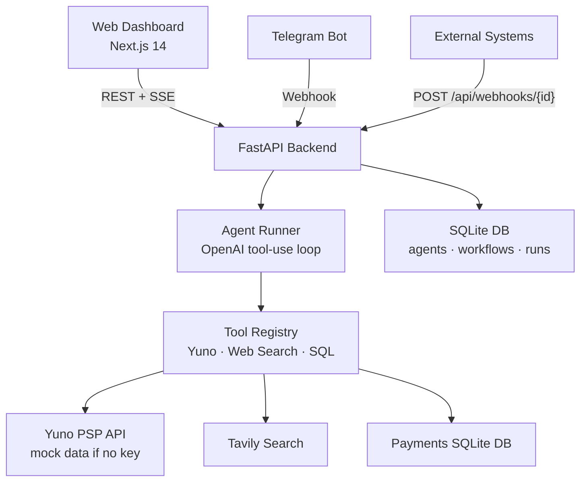

# Yuno AI Agent Platform

> Build, configure, and run AI agents with tools and workflows — purpose-built for payment operations.


---

## Overview

The Yuno AI Agent Platform lets you create AI agents in plain English, wire them into multi-step workflows, and watch them execute in real time. It is built around Yuno's payment orchestration context — agents have native access to PSP connector data, transaction records, and chargeback queues — but the tool and workflow system is general enough for any automation use case.

You interact with the platform in two ways: a **web dashboard** (agent builder, visual workflow editor, live monitoring) and a **Telegram bot** (chat with any agent, run workflows, receive alerts). Both interfaces share the same backend, so an agent configured in the UI is immediately available on Telegram.

Agent creation is AI-assisted: describe what you want in a sentence and the platform generates a full system prompt, tool selection, and config. You review, tweak, and save — no YAML or JSON required.

---

## Features

- **AI-generated agent configs** — describe an agent in plain English; Claude drafts the system prompt and tool list
- **Tool use** — Yuno PSP tools (approval rates, connectors, chargebacks), Tavily web search, natural-language SQL queries on a payments database
- **Visual workflow builder** — React Flow DAG editor with node types: Trigger, Agent, Webhook Response, Send to Telegram
- **Real-time event streaming** — SSE streams execution logs, tool calls, and results to the browser as they happen
- **Telegram bot** — chat with any agent or run workflows directly from Telegram; receive alerts and workflow output
- **Webhook triggers** — external systems POST to `/api/webhooks/{id}` to start a workflow; results are POSTed back to a callback URL
- **Run monitoring** — dashboard showing run history, live log replay, status tracking
- **Credential management** — UI to add/edit/delete API keys stored as environment variables, no file editing required
- **Mock-ready Yuno tools** — all Yuno PSP tools return realistic mock data when no API key is configured, so the demo works out of the box

---

## Architecture



---

## Quick Start (Local)

**Prerequisites:** Python 3.11+, Node.js 20+, an OpenAI API key

```bash
# 1. Clone
git clone <repo-url>
cd agent-platform

# 2. Backend
cd backend
python -m venv venv
source venv/bin/activate          # Windows: venv\Scripts\activate
pip install -r requirements.txt
cp ../.env.example .env
# Edit .env — set OPENAI_API_KEY at minimum

# 3. (Optional) Load sample payment data
cd ..
python load_transactions.py

# 4. Start backend
cd backend
uvicorn main:app --reload --port 8000

# 5. Frontend — new terminal
cd frontend
npm install
npm run dev
```

Open [http://localhost:3000](http://localhost:3000).

**Convenience script** (starts both backend and frontend):
```bash
chmod +x start.sh && ./start.sh
```

### Minimum required environment variables

| Variable | Required | Purpose |
|---|---|---|
| `OPENAI_API_KEY` | Yes | Agent generation + execution |
| `TELEGRAM_BOT_TOKEN` | No | Telegram bot interface |
| `TAVILY_API_KEY` | No | Web search tool |
| `API_SECRET_KEY` | No | Auth for credentials API (empty = open in dev) |

See `.env.example` for the full list with descriptions.

---

## Deployment

### Backend → Railway

1. Push code to GitHub (use the clean `yuno-deploy/backend/` folder)
2. New Railway project → **Deploy from GitHub** → set **Root Directory** to `backend/`
3. Railway detects the `Procfile` automatically:
   ```
   web: uvicorn main:app --host 0.0.0.0 --port $PORT
   ```
4. Add all variables from `.env.example` in the Railway **Variables** tab — never commit `.env`
5. Set `ALLOWED_ORIGINS=https://your-app.netlify.app` (your Netlify URL)

### Frontend → Netlify

1. New Netlify site → **Import from GitHub** → set **Base directory** to `frontend/`
2. `netlify.toml` is pre-configured (build command + Next.js plugin)
3. In Netlify **Environment Variables**, add:
   ```
   NEXT_PUBLIC_API_URL=https://your-backend.railway.app
   ```
4. First deploy: run `npm install @netlify/plugin-nextjs` locally inside `frontend/` and commit the updated `package.json`

### Production checklist

- [ ] `OPENAI_API_KEY` set in Railway
- [ ] `API_SECRET_KEY` set to a random string in Railway
- [ ] `ALLOWED_ORIGINS` set to your Netlify URL in Railway
- [ ] `NEXT_PUBLIC_API_URL` set to your Railway URL in Netlify
- [ ] `TELEGRAM_BOT_TOKEN` set (if using Telegram)

---

## Use Cases

### Payment Operations
- **PSP health monitoring** — create an agent with `yuno_get_approval_rate` and `yuno_list_connectors`; schedule it every 15 minutes; configure it to send a Telegram alert when approval rate drops below 85%
- **Natural-language data queries** — ask "show me all failed Stripe transactions in the last 24 hours" and the agent writes and executes the SQL for you

### Chargeback Management
- Build a workflow: Trigger (webhook from your payment platform) → Research Agent (fetches transaction evidence) → Draft Agent (writes dispute response) → Send to Telegram for human review
- Human approves or rejects directly in Telegram; the workflow continues accordingly

### Developer Productivity
- Describe an agent in one sentence and get a full system prompt + tool config in seconds
- Build multi-step pipelines visually without writing orchestration code
- Use the webhook endpoint to connect any external system — receive results at your callback URL

### Custom Integrations
```bash
# Trigger a workflow from any external system
curl -X POST https://your-backend.railway.app/api/webhooks/<workflow-id> \
  -H "X-API-Key: your-secret" \
  -H "Content-Type: application/json" \
  -d '{"task": "Analyze Q3 chargeback spike", "callback_url": "https://your-system.com/results"}'
```

---

## Project Structure

```
agent-platform/
├── backend/
│   ├── main.py              # FastAPI app — all routes
│   ├── agent_factory.py     # AI-assisted agent config generation
│   ├── agent_runner.py      # OpenAI tool-use execution loop + SSE streaming
│   ├── bot.py               # Telegram bot
│   ├── database.py          # SQLAlchemy models (agents, workflows, runs, credentials)
│   ├── tools/
│   │   ├── registry.py      # Decorator-based tool registration
│   │   ├── yuno_tools.py    # Yuno PSP tools (mock-ready)
│   │   ├── web_search.py    # Tavily web search
│   │   └── database_tool.py # SQL queries on payments DB
│   ├── Procfile             # Railway run command
│   ├── runtime.txt          # Python 3.11 pin for Railway
│   └── requirements.txt
├── frontend/
│   ├── netlify.toml         # Netlify build config
│   ├── next.config.js       # NEXT_PUBLIC_API_URL passthrough
│   └── src/app/
│       ├── page.tsx          # Agent list
│       ├── create/           # AI-assisted agent creation wizard
│       ├── agents/[id]/      # Agent detail + run
│       ├── workflow/         # Workflow list + visual DAG editor
│       ├── monitoring/       # Run history + live event stream
│       └── settings/         # Credential management UI
├── .env.example             # All variables documented
├── load_transactions.py     # Seeds sample payment data (SQLite)
└── transactions.csv         # Sample data for load_transactions.py
```

---

## Extending the Platform

### Adding a new tool

```python
# backend/tools/my_tool.py
from .registry import register_tool

@register_tool(
    name="my_tool_name",
    description="One-line description shown to the LLM",
    parameters={
        "my_param": {"type": "string", "description": "What this parameter does"}
    }
)
def my_tool(my_param: str) -> dict:
    return {"result": "..."}
```

Import it in `tools/__init__.py` and it appears automatically in the Tools picker when creating agents.

### Adding a new workflow node type

1. Add the type literal to `WorkflowNodeType` in [frontend/src/lib/api.ts](frontend/src/lib/api.ts)
2. Create the visual component in `frontend/src/components/` (follow the pattern of existing node components)
3. Add execution logic inside `_run_workflow_stream()` in [backend/main.py](backend/main.py)

### Adding a new messaging channel

Create an adapter class with `send_message(recipient, text)` and a webhook route in `main.py` that parses incoming messages and routes them to `agent_runner.run_agent_chat()`. The Telegram implementation in `bot.py` is a complete reference example.

---

## Tech Stack

| Layer | Technology |
|---|---|
| Frontend | Next.js 14, React 18, TypeScript, Tailwind CSS |
| Workflow editor | @xyflow/react (React Flow) |
| Backend | Python 3.11, FastAPI, SQLAlchemy |
| AI execution | OpenAI API (function calling / tool use) |
| Web search | Tavily API |
| External channel | python-telegram-bot |
| Database | SQLite (local dev), PostgreSQL-ready |
| Deployment | Railway (backend), Netlify (frontend) |

---

## Roadmap

### v1.1 — Multi-model support
- Anthropic Claude and Google Gemini as selectable models per agent
- Automatic model routing: cheapest model for classification, strongest for drafting

### v1.2 — Persistent memory
- pgvector long-term memory: agents remember past conversations and outcomes across runs
- Semantic search over agent history

### v1.3 — Workflow template library
- Pre-built templates: Payment Health Monitor, Chargeback Responder, Dispute Drafter
- One-click instantiation from a gallery; customize before saving

### v1.4 — Multi-agent collaboration
- Agents can invoke other agents as tools
- Parallel execution branches in the workflow DAG

### v2.0 — Production grade
- PostgreSQL + Redis replacing SQLite
- Celery workers for background and scheduled execution
- Role-based access control (admin / operator / read-only)
- Full audit log for every agent action
- Per-run cost tracking (prompt tokens, completion tokens, USD)

---

## Running Tests

```bash
# Backend
cd backend
pytest tests/

# Frontend type check
cd frontend
npm run type-check
```

---

## License

MIT
